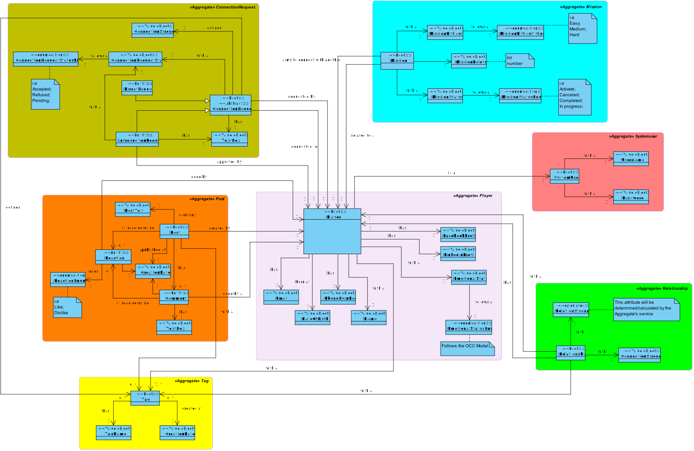

# README #

Neste ficheiro README devem documentar/justificar decisões tomadas relativamente a alterações feitas ao Modelo de domínio, de modo a todos ficarem claros do porquê de tais decisões.

## Como devo proceder à documentação? ###

* Indicar a data da alteração
* Indicar quais as alterações feitas, junto com a justificação das mesmas (caso a alteração não seja clara)
* Identificar quem fez as alterações

## Modelo de domínio (DDD) ###

## Documentação ###

### 21/10/2021 - Pedro Vieira (1190948)

* Recolhi os diferentes conceitos apresentados no caderno e encargos e identifiquei-os como *Root*, *Entity* ou *Value Object*, bem como as ligações entre eles e os agregados a que pertencem.

* Relativamente aos pedidos de ligação de um utilizador ao outro, eu identifiquei uma *Root* **abstrata** que representa todas os possíveis pedidos que um utilizador pode fazer a outro, e 2 *Entities*, uma para os pedidos de introdução e outro para os pedidos de ligação direta.

### 22/10/2021 - Pedro Vieira (1190948)

* Com ajuda de um anexo disponiblizado pelo professor (Figura 4 em https://moodle.isep.ipp.pt/mod/resource/view.php?id=29404) percebi como agrupar o agregado relativo às forças  de ligação entre os utilizadores.

* Adicionei alguns *Value Objects* para complementar informação adicional a certas Entidades

### 24/10/2021 - Pedro Vieira (1190948)

* Alterei o Stereotype dos concentios do status de Missão e do pedido de coneção de "Entity" para "Value object", uma vez que achei que estes mesmos conceitos não têm entidade dentro do negócio e só servem como conceito caracterizador da "Entity", Missão e Pedido de coneção, respetivamente.

* Relativamente à força da ligação entre dois utilizadores, considerei que esta seria um conceito **Abstrato**, ao qual será extendido dependento dos diferentes tipos de força de ligação que o negócio ditará.  

### 28/10/2021 -António Barros (1200606)

* Alterei o DDD alterando o nome da entidade postReaction para Reaction para se perceber melhor, alterei o nome do postReactionEnum para ReactionEnum pelo mesmo motivo. Adicionei uma relação entre Coment e Reaction como está explicito no fórum (https://moodle.isep.ipp.pt/mod/forum/discuss.php?d=11076) e adicionei uma relação entre o RelationShip  e Player para mostrar melhor a relação entre um Player e outro Player.